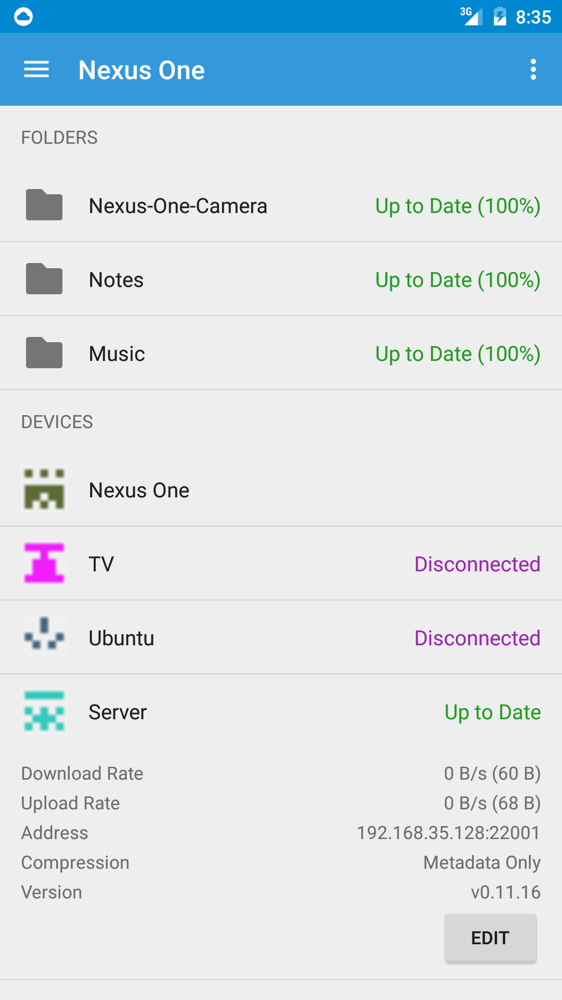
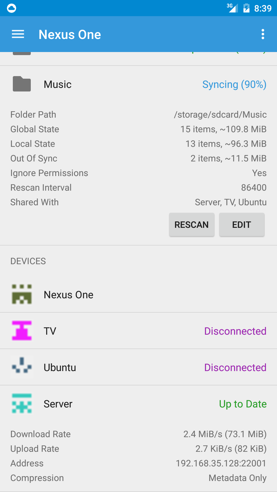
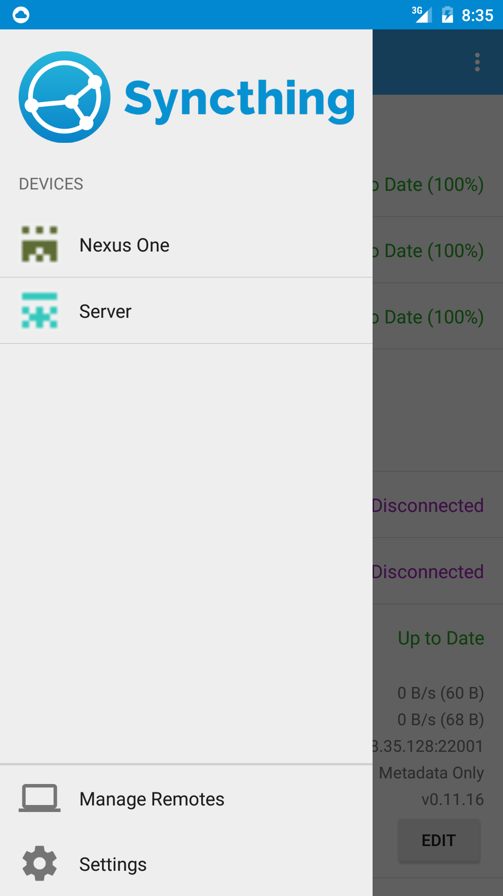

##Syncthing Silk for Android

[](http://android.syncthing.net/job/Syncthing-Silk/)





This app aims to be a full featured [Syncthing](https://syncthing.net/) client comparable to the web ui.
It is based on [SyncthingAndroid from OpenSilk](https://github.com/OpenSilk/SyncthingAndroid) but with a focus on user friendliness.
This includes:
  - A welcome dialog explaining the basics of Syncthing Silk for Android
  - Support for file watchers (based on [Syncthing-inotify](https://github.com/syncthing/syncthing-inotify))
  - A directory picker
  - In-app TLS to preserve Androids sandboxing
  - Asynchrounous key generation in the background
  - Cancelling login processes
  - Support for intel/i386 cpus
  - Meaningful default device name
  - A default local Syncthing instance

###Custom Settings

Syncthing runs with a number of custom settings to optimise your experience and to avoid conflicts with other applications (e.g. [Syncthing for Android application](https://github.com/syncthing/syncthing-android)). In particular:
  - Default GUI address is set to 127.0.0.1:8385 (TLS on)
  - Default Listen Address is set to 0.0.0.0:22001
  - Default Local Announce Port is set to 21040
  - Default Local Announce MCAddr is set to [ff32::5222]:21041
  - Default Rescan Interval is set to 86400 seconds (1 day)
  - Default Ignore Permissions are enabled
  - Default IPv4 and IPv6 Global Announce Server is an ip instead of a domain name (see Github issue #4)
  - Default folder is set to Environment.DIRECTORY_DCIM

###Building

#####Syncthing binary

```bash
# Build Syncthing
./build-syncthing-go.sh
# Build Syncthing-inotify
./build-syncthing-inotify.sh
```

#####App

```bash
# Build apk
./gradlew app:assembleDebug
```

###Contributing

Pull requests are welcome via github. However, be aware that we frequently rebase this codebase on top of [SyncthingAndroid from OpenSilk](https://github.com/OpenSilk/SyncthingAndroid). This means we will break your git tree.

